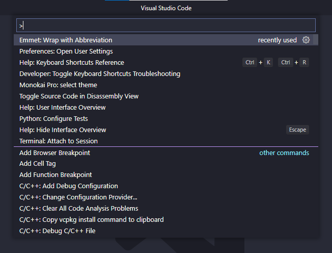
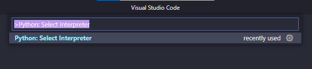
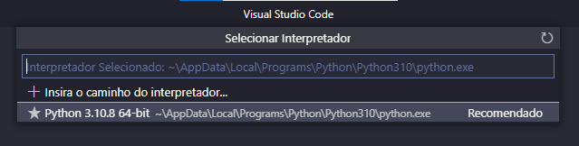

# Pika

Pika is a pure-Python implementation of the AMQP 0-9-1 protocol including RabbitMQ’s extensions.

## Installation
### Enviroment configuration

Use the package manager [pip](https://pip.pypa.io/en/stable/) to install pika.

```python
#install the venv into your project folder
py -m venv venv 
or 
python -m venv venv

# install the pika lib
pip3 install pika

```

## Visual Studio Code config

Press (Ctrl + Shift + P) and open the command pallet



Into the command pallet type: Python: Select Interpreter



Select the + option into the command pallet



Navigate to your 'venv' project folder and select the python.exe and yout project is ready to go.

## License

[MIT](https://choosealicense.com/licenses/mit/)
